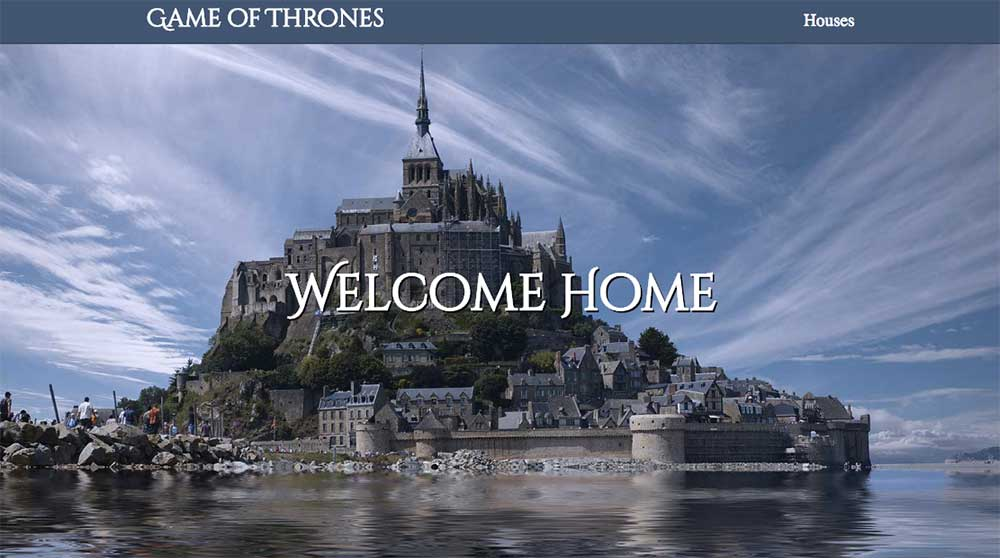

# Game of Thrones Rails App

## Overview
Ruby on Rails app that implements CRUD functionality on house and character models. Includes links to different paths, forms to add/update records, and has validations, error-handling, and flash. The app also makes use of nested routes.

## Technologies Used
* Ruby on Rails
